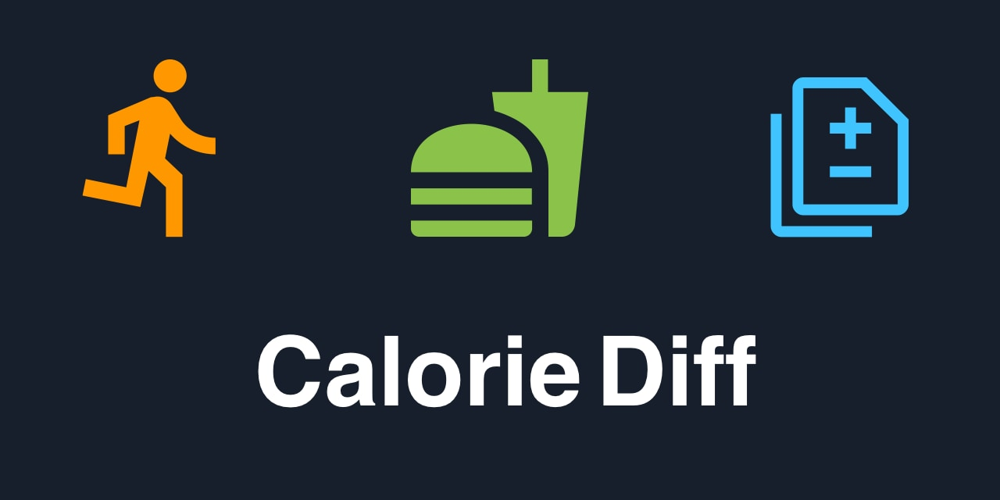

# Calorie Diff

## Backstory

I train quite a lot, and with that comes proper nutrition control, I make use of MFP for tracking food,
however, it only imports exercise activities from external data sources, which is by no means a complete
picture.

As an Apple user, I was also not able to find an easy way to get the data I wanted out, not even with Shortcuts.

I simply wanted a quick glance at my caloric status, am I in deficit or surplus.

This app, while probably an over engineered solution, deals with that, it takes in teh Active, Resting and Dietary
energy from AppleHealth and does just that, displays you intake, your output and the difference.

